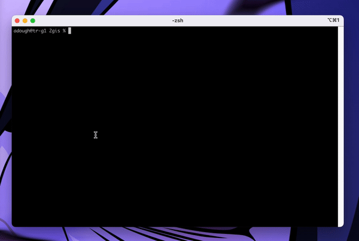

# Coding Test: data search

## Оглавление
0. [Проблема](#Проблема)
1. [Алгоритм Кнута - Морриса - Пратта](#Алгоритм-Кнута---Морриса---Пратта)
2. [Алгоритм STL](#Алгоритм-STL)
3. [Алгоритм Ахо - Корасик](#Алгоритм-Ахо---Корасик)
3. [Таблица сравнения алгоритмов](#Таблица-сравнения-алгоритмов)

## Пример работы:

Программа разработана на концепции MVC `Model-View-Controller`.

Для запуска приложения нужно запустить makefile `make`

## Проблема
### Постановка задачи:
У нас есть две последовательности данных, назовем их `haystack` и `needle`. Нам надо найти все вхождения любой последовательности данных `needle` у которой длина больше или равна `threshold` в `haystack`.

Существует огромное множество алгоритмов для решения данной задачи, основная проблема кроется в решение в лоб `brute force algorithm`.

Алгоритм осуществялется с помощью прямого поиска. Скорость данного алгоритма `O(haystack * needle)`. Для строк маленького значения алгоритм работает быстрее приведенных ниже, но все меняется, когда строки огромного значения.

Для обработки Big data прямой алгоритм не годится. Дальше, я привожу реализации трех алгоритмов, которые решают данную проблему.

В данной задани основной проблемой является разбиение строки needle на подстроки, данный алгоритм реализован за время `O(needle * needle)`. Реализация алгоритмов ниже, не учитывает время работы этого алгоритма.

## Алгоритм Кнута - Морриса - Пратта
Алгоритм Кнута-Морриса-Пратта (КМП) позволяет находить префикс-функцию от строки за линейное время.

Суть алгоритма заключается в движение по строке и сравнение последовательно символов образцов. Если символ не совпал, то перемещаемся на один шаг в начало сравнения и снова сравниваем.

Время работы линейно зависит от объема входных данных. Скорость данного алгоритма `O(hatstack)`.

## Алгоритм STL

Алгоритм написан с использованием стандартной функции `STL find`.
Метод `find` возвращает итератор на найденный элемент, если элемент не был найден, то возвращает npos.

Время работы алгоритма составляет `O(haystack)`

## Алгоритм Ахо - Корасик

Строит конечный автомат, который распознаёт язык, состоящий из одной-единственной строки. После небольшой модификации позволяет за один проход по haystack найти одну строку из нескольких.

В структуре данного алгоритма лежит преффиксное дерево `бор`. Он является конечным автоматом, который распознает одну подстроку needle из haystack.

Сложность алгоритма `O(haystack)`

## Таблица сравнения алгоритмов

| № | Алгоритм | Описание | Сложность |
| --- | -------- | ----------- | -------- |
| 1 | `Алгоритм Кнута — Морриса — Пратта` | В основе реализации алгоритма лежит идея `префикс-функции` | `O(haystack)` |
| 2 | `Алгоритм STL` | В основе реализации алгоритма лежит стандартная функция `find` из библиотеки `STL` | `O(haystack)` |
| 3 | `Алгоритм Ахо - Корасик` | В основе реализации алгоритма лежит `суфиксное дерево` | `O(haystack)` |

